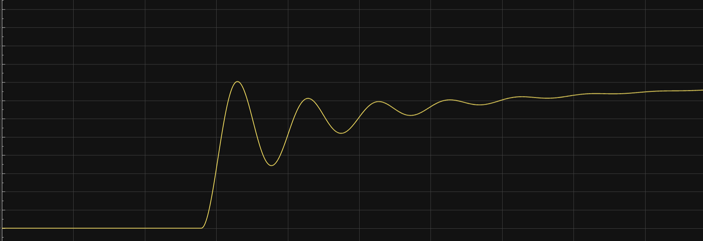
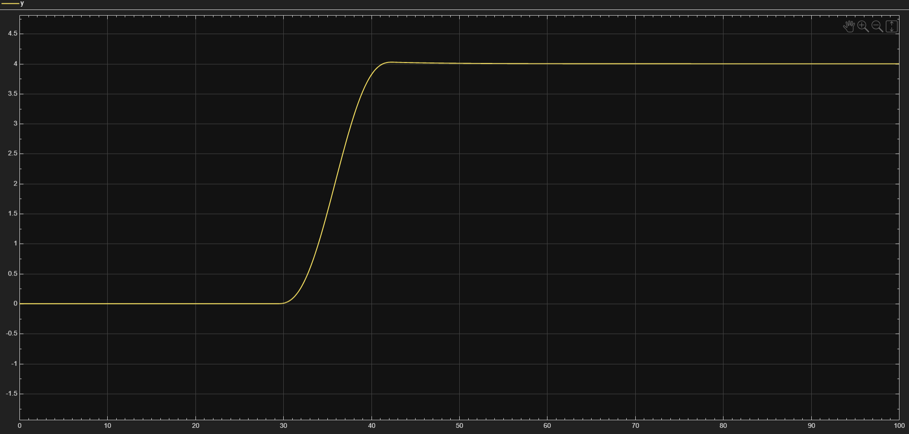
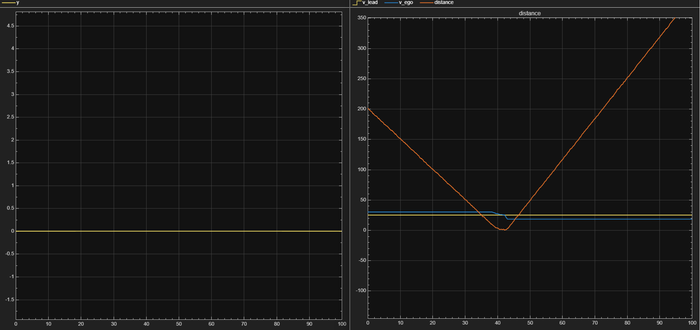
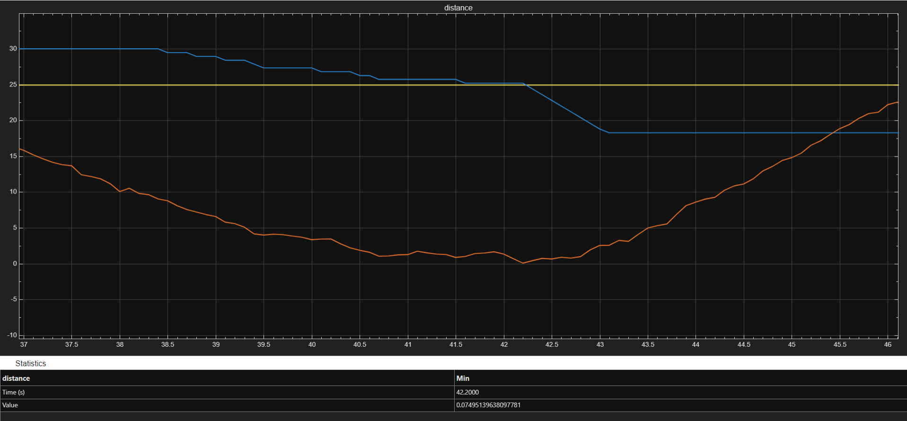
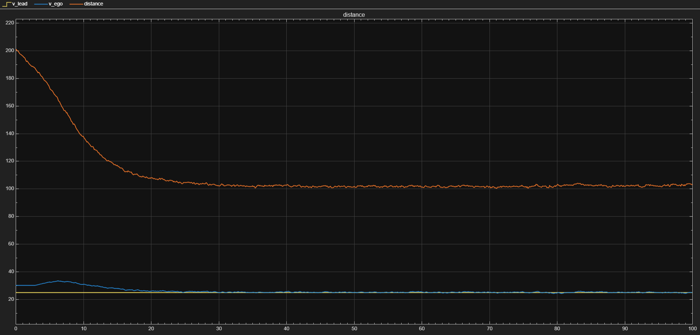
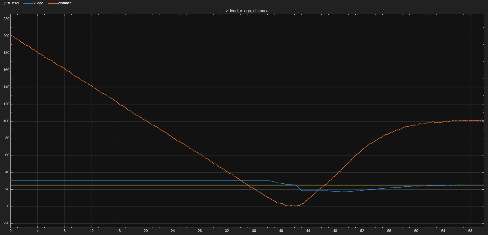
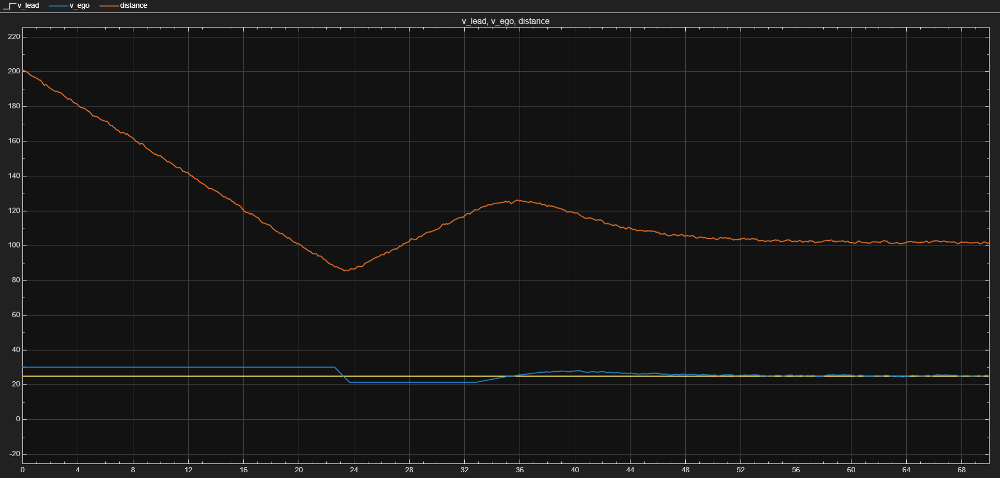
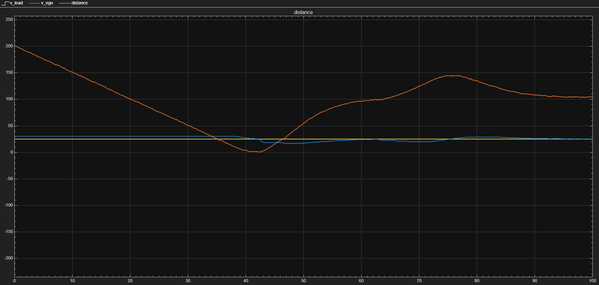

# Zaawansowane Systemy Wsparcia Kierowcy (ADAS) w MATLAB/Simulink
 
> **Konkurs RCDC 2026** | Zespół: **Transfer Function Team**  
> Mateusz Łaś · Paweł Kowalewski · Tomasz Mazur · Aleksander Młynarski
 
---
 
## O projekcie
 
Model symulacyjny implementujący trzy zintegrowane systemy bezpieczeństwa i komfortu jazdy klasy ADAS, zrealizowany w środowisku MATLAB/Simulink. Centralnym wskaźnikiem decyzyjnym całego systemu jest **TTC (Time-To-Collision)** — czas do potencjalnej kolizji obliczany w czasie rzeczywistym na podstawie danych z wirtualnego radaru. Wszystkie podsystemy współdzielą ten wskaźnik i reagują na niego w sposób zhierarchizowany, tworząc spójną architekturę kaskadową.
  
---
 
## Zaimplementowane systemy
 
### 1. Filtr radaru
 
Sygnał z radaru jest obarczony szumem, dlatego przed przekazaniem do logiki decyzyjnej przechodzi przez filtr dolnoprzepustowy pierwszego rzędu (eksponencjalna średnia krocząca):
 
```
alpha = dt / (tau + dt)
clean_distance = alpha · raw_distance + (1 - alpha) · last_distance
```
 
Przy `tau = 0.02 s` i `fs = 100 Hz` współczynnik `alpha ≈ 0.33` — filtr skutecznie wygładza pomiar, zachowując jednocześnie szybką reakcję na rzeczywiste zmiany dystansu.
 
---
 
### 2. System Hamowania Awaryjnego (AEB — Autonomous Emergency Braking)
 
Kluczowy moduł bezpieczeństwa o najwyższym priorytecie wykonawczym. Algorytm operuje na dynamicznie wyznaczanym progu TTC uwzględniającym aktualne warunki ruchu.
 
**Logika decyzyjna:**
 
```
v_wzgl     = v_ego − v_lead
TTC        = distance / |v_wzgl|
prog_czaso = v_wzgl / opóźnienie_hamowania      (opóźnienie = 8 m/s²)
prog_final = prog_czaso + 1.2 s                 (margines bezpieczeństwa)
 
TTC ∈ [prog_final, prog_final + 1.0)  →  warning = 1   (czas na reakcję kierowcy)
TTC < prog_final                       →  hamowanie = 1  (AEB interweniuje)
object_detected = 0  →  TTC = inf     (system uśpiony)
```
 
Priorytet intencji człowieka jest zachowany — jeśli kierowca sam wciśnie hamulec w oknie ostrzegawczym, AEB nie nadpisuje jego decyzji. System wyłącza się automatycznie gdy pojazd Ego wykonuje manewr zmiany pasa (`pas_zmieniony` — flaga fizycznej obecności na nowym pasie, nie samej inicjacji manewru).
 
---
 
### 3. Adaptacyjny Tempomat (ACC — Adaptive Cruise Control)
 
Podsystem sterowania wzdłużnego utrzymujący zadany dystans referencyjny `dist_ref = 100 m`. Zbudowany na **regulatorze PD** w pętli sprzężenia zwrotnego.
 
**Parametry regulatora:** P = 0.1 · D = 0.8 · N = 10 (filtr członu różniczkującego)
 
```
e(t)    = distance − dist_ref       (uchyb dystansu)
delta_v = PD(e)                     (korekta prędkości)
v_ego   = ∫(delta_v + hamowanie) dt
```
 
Aktywacja i dezaktywacja oparta na **przerzutniku SR**. Tempomat automatycznie wyłącza się gdy aktywne jest hamowanie manualne lub awaryjne AEB, i może zostać ponownie włączony po ustaniu zagrożenia.
 
---
 
### 4. Asystent Zmiany Pasa (ALC — Automated Lane Change)
 
Moduł sterowania poprzecznego realizujący bezpieczny manewr wyprzedzania gdy sytuacja na drodze tego wymaga.
 
**Warunek inicjacji manewru:**
```
5 s ≤ TTC ≤ 20 s  AND  czy_pas_wolny = 1
```
Dolny próg (5 s) chroni przed zbyt późną inicjacją manewru — poniżej tej wartości TTC priorytet przejmuje AEB. Górny próg (20 s) zapewnia, że manewr nie jest wykonywany przy komfortowym dystansie.
 
**Trajektoria zmiany pasa** generowana jest przez wielomian 5. rzędu (quintic), zapewniający zerową pochodną (zerowe przyspieszenie boczne) zarówno na początku jak i końcu manewru:
 
```matlab
s      = min(dt / t_manewr, 1.0)        % t_manewr = max(5s, v_ego · 0.45)
y_ref  = W · (10s³ − 15s⁴ + 6s⁵)       % W = 4.0 m (szerokość pasa)
```
 
Czas trwania manewru jest **uzależniony od prędkości** — im szybciej jedzie pojazd, tym łagodniejszy i dłuższy manewr. Trajektoria referencyjna podawana jest do regulatora **PD bocznego** sterującego kątem skrętu w modelu kinematycznym Bicycle Model (rozstaw osi 2.7 m, max skręt π/4 rad).
 
Manewr jest nieodwołalny po inicjacji — persistent flag w `ref_generator` blokuje reset sygnału `y_ref` niezależnie od dalszych zmian TTC.
 
---
 
## Parametry symulacji
 
| Parametr | Zmienna | Wartość | Opis |
|:---|:---|:---:|:---|
| Prędkość Ego | `v_ego` | 30 m/s | Prędkość początkowa pojazdu własnego |
| Prędkość celu | `v_lead` | 25 m/s | Prędkość pojazdu poprzedzającego |
| Dystans początkowy | `d_init` | 200 m | Odległość startowa między pojazdami |
| Dystans referencyjny | `dist_ref` | 100 m | Cel tempomatu ACC |
| Zasięg radaru | `radar_max_range` | 150 m | Maksymalny zasięg detekcji |
| Próbkowanie | `fs` | 100 Hz | Częstotliwość próbkowania radaru |
| Stała filtru | `tau_radar` | 0.02 s | Stała czasowa filtru EMA |
| Opóźnienie hamowania | `delay` | 8 m/s² | Maksymalne opóźnienie AEB |
 
---
 
## Wyniki symulacji
 
### Zmiana pasa — przed i po optymalizacji
 
| Przed optymalizacją | Po optymalizacji (wielomian 5. rzędu) |
|:---:|:---:|
|  |  |
| Przeregulowania i oscylacje wynikające z użycia Pure Pursuit z długim lookahead | Idealna odpowiedź — brak oscylacji, zerowe przyspieszenie boczne na krańcach manewru |
 
Pierwotna implementacja oparta na Pure Pursuit (lookahead = 40 m) generowała silne oscylacje pozycji bocznej. Po zastąpieniu kontrolerem PD z generatorem trajektorii quintic uzyskano charakterystykę zbliżoną do odpowiedzi inercyjnej I rzędu.
 
---
 
### Hamowanie awaryjne AEB
 

 

 
System skutecznie wytraca prędkość pojazdu Ego. Odległość minimalna wynosi **0.075 m** — kolizja uniknięta przy maksymalnym wykorzystaniu dostępnej przestrzeni. Gdy kierowca zareaguje hamowaniem w oknie ostrzegawczym, AEB poprawnie rezygnuje z interwencji i przekazuje kontrolę człowiekowi.
 
---
 
### Tempomat ACC
 

 
Po aktywacji w 3. sekundzie symulacji dystans płynnie dąży do wartości zadanej 100 m bez przeregulowań. Regulator PD zapewnia stabilną regulację przy zmiennej prędkości pojazdu poprzedzającego.
 
---
 
### Scenariusze integracyjne
 
| Tempomat + AEB | Tempomat + hamulec manualny | Tempomat + AEB + hamulec manualny |
|:---:|:---:|:---:|
|  |  |  |
| Skuteczna regulacja PD — po interwencji AEB i ustaniu zagrożenia tempomat wznawia pracę bez zakłóceń | Manualne hamowanie deaktywuje tempomat; ponowna aktywacja po 33 s skutkuje łagodnym powrotem do śledzenia dystansu | Każde hamowanie (manualne lub awaryjne) deaktywuje tempomat, potwierdzając poprawną hierarchię priorytetów |
 
---
 
## Uruchomienie
 
```
1. Otwórz MATLAB i ustaw Current Folder na katalog projektu
2. Uruchom skrypt inicjalizacyjny:  >> run('dane.m')
3. Skrypt automatycznie załaduje parametry i otworzy model.slx
4. Uruchom symulację w Simulinku (przycisk Run lub Ctrl+T)
```
 
Wszystkie parametry symulacji konfigurowane są wyłącznie przez `dane.m` — nie ma potrzeby ręcznej edycji modelu.
 
---
 
## Struktura repozytorium
 
```
├── dane.m              # Skrypt inicjalizacyjny — wszystkie parametry
├── model.slx           # Główny model Simulink
└── symulacje/          # Wyniki symulacji (wykresy .png)
```